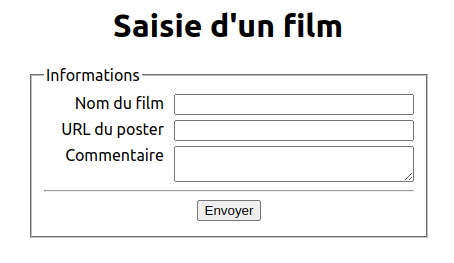

# Form Movie

Réalisé dans le cadre d'un exercice de la Wild Code School. 

Affiche un formulaire qui permet de mettre à jour une API.

Formulaire aussi visible ici (API non connectée) : [https://form-movie.netlify.app/](https://form-movie.netlify.app/)
